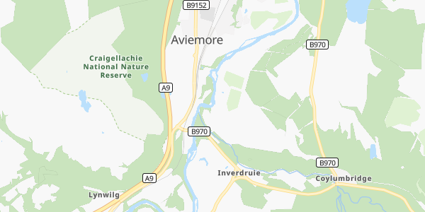

# Map Web GL JS rasterizer

This project comes from a silly idea: creating a raster map web server, using the browser lib [MapLibre GL JS](https://github.com/maplibre/maplibre-gl-js) as a rendering engine instead of the low-level [MapLibre GL native](https://github.com/maplibre/maplibre-gl-native) lib.

Under the hood, it launches a headless Chromium browser with [Puppeteer](https://github.com/puppeteer/puppeteer), go to a special page with a Maplibre GL JS map instance, and takes screenshots to serve as images.

## Example

Request: `http://localhost:3000/?width=600&height=300&zoom=12&center=-3.825,57.185&style=qwantmaps`

Result:



## Usage

### Configuration

The [`mapstyles.json`](./mapstyles.json) file contains an array of available map styles. Each is defined by 3 properties:

 - `name`: the style name, used to specify which style to render for multiple style instances
 - `styleUrl`: the url of the vector map style definition in JSON
 - `attribution`: the attribution string, to display proper copyright information on each generated image

You should replace the styles in the current file by styles you own.

### Starting the server

```
$ node index.js
```

By default, it runs on the port 3000. You can specify another port using an env var.

```
$ PORT=3666 node index.js
```

### Requests

Then go to `http://localhost:<port>/` and send queries with those query string parameters:

|Parameter|Description|Default|
|---|---|---|
|`style`|Name of the map style, as defined in the `mapstyles.json` file |First defined style|
|`center`|Coordinates of the center, as `<longitude>,<latitude>`|`0,0`|
|`zoom`|Zoom level|`3`|
|`width`|Image width in pixels|`400`|
|`height`|Image height in pixels|`400`|
|`type`|`png` or `jpeg`|`png`|

